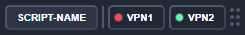

# VPN Switcher

This application simplifies switching between VPNs, saving time and improving workflow. Ideal for anyone who uses multiple VPNs.

## Features

- Switch between two VPNs with a single click.
- JSON-based configuration.
- Lightweight design.

## Installation

**Windows Users**: You can download the latest build of the application from the [Releases](https://github.com/rpusec/vpn-switcher/releases) section.  
Run `vpn-switcher.exe` from the root directory.  

**Other Platforms**: Follow the instructions below to build the application manually.

1. Ensure [Node.js](https://nodejs.org/) and [NPM](https://www.npmjs.com/) are installed.
2. Clone the repository.
3. Use `npm install` to install all of the dependencies.
4. Use `npm start` to launch the application.
5. To create a working build for your platform:
   - Run `npm run make`.
   - Execute `vpn-switcher.exe` within your `/out/vpn-switcher-[PLATFORM]` directory.

## Configuration

The application uses a `config.json` file for configuration, stored in the root directory. If the file does not exist, it will be autogenerated.

## Sample Configuration

```json
{
	"vpns": [
		"vpn1",
		"vpn2"
	],
	"scripts": [
		{
			"name": "script-name",
			"path": "C:\\path\\to\\script.js",
			"enabledWhenActiveVPN": "vpn2"
		}
	],
	"bounds": {
		"x": 1689,
		"y": 996
	}
}
```

## Configuration Options

`vpns` An array of strings representing the VPN names configured in Windows' VPN settings.

`scripts` An array of additional scripts to execute from the UI. 
 * `name` Display name of the script in the application.
 * `path` Absolute path to the script.
 * `enabledWhenActiveVPN` (Optional) Limits script execution to a specific VPN.

`bounds` Stores the application's position on the screen. These values are updated automatically when you move the window. 

## Screenshots
  


## License
This project is licensed under the MIT License - see the [LICENSE](LICENSE.md) file for details.
